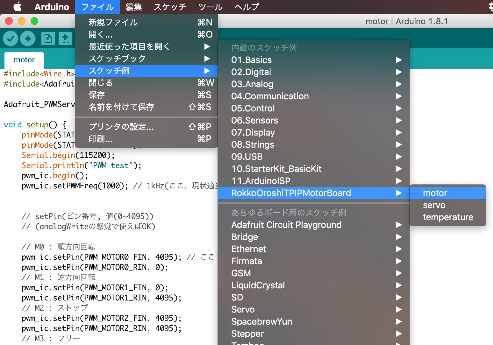
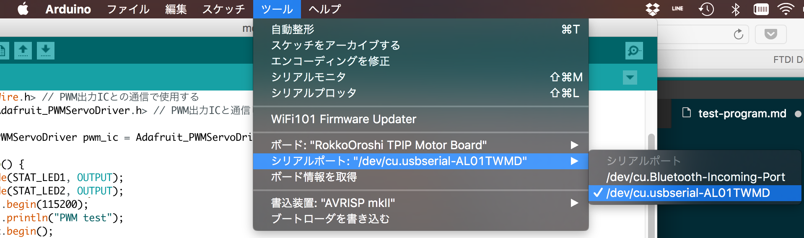

# テストプログラムの実行

先ほどの操作により，以下のようにたどるとこのボード専用のサンプルプログラムが追加されている．

好きなものを選んでボードに書き込めば良い．



## 書き込みの準備

[FIDIのUSBシリアル変換ドライバ](http://www.ftdichip.com/FTDrivers.htm)のインストールが必要．（Macでは何も入れずとも書き込みができた．）

ボードをPCにつなぐと，`ツール` → `シリアルポート`にそれっぽいものが出てくるはずなので選択する．自分の場合，以下のようなものが出てきた．



また，`ツール` → `ボード` で `RokkoOroshoi TPIP Motor Board` を選択しておく．``これをしないとコンパイルできない``．また，下手に間違ったボードを選ぶと，ボード内部のファームが破壊されて，ファームの再書き込みが必要になる場合があるよう．


## 書き込み

サンプルプログラムのうちどれか一つを選んで選択（一番上の画像参照）し，書き込みボタン（→）を押すと書き込まれる．

## シリアル通信

多くのプログラムはPCに何らかの文字列を送ってきたり，逆にPCから送られてきた文字列に応答したりするように作ってある．

右上のシリアルモニタボタンを押し，右下の部分を`115200bps`に設定すると良い．プログラムによっては`9600bps`の場合もある．

プログラムの

```
 Serial.begin(xxxxxx);
```

の`xxxxxx`の部分を見れば良い．異なる速度を選択すると文字化け（ではないが）のような感じになり，読めない．

改行文字に関しては詳しく知らないが，うまく設定しないとPCから送ったデータがうまく受け取られないらしい．