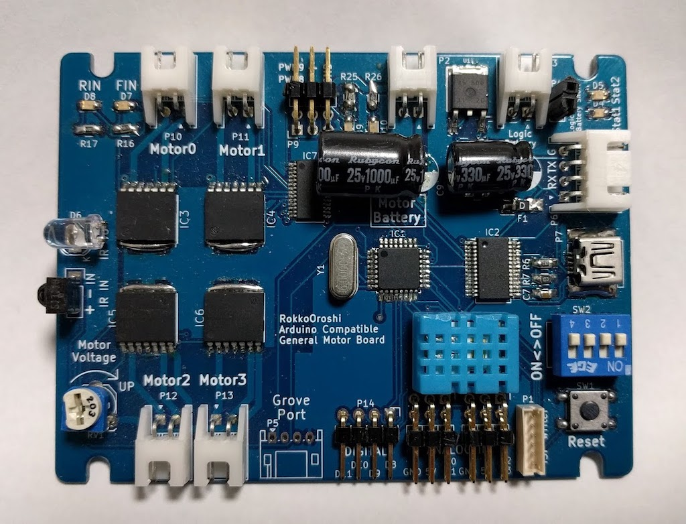
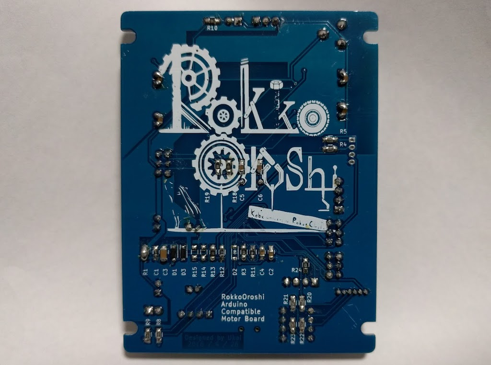

[神戸大学　ロボット研究会六甲おろし](http://rokko-oroshi.xrea.jp)

この文章はArduinoを触ったことがない初心者（部員）向けに書いたつもりです．

# TPIP3サイズのArduino互換ボード

- 2016年度レスコン４号機で使用するために制作
- TPIP3の画像ボードとぴったり重ねられるように設計
- TPIPの制御ボードの置き換えを意図

## 制作例

| front | back |
|---|---|
|  |  |

> 何か絵が入れたかった

> 電源が不安定で試行錯誤したのでコンデンサが不恰好

## 機能一覧

* ４つのモータをPWM制御
* ２つのサーボモータ用PWM出力
* 赤外線送受信
* 温度センサー
* 状態表示用LEDx2
* アナログ入力対応汎用ポート x4 （5V, GND付き）
* 汎用ディジタルIOポート x4（二つはスイッチとポート兼用）
* スイッチ入力 x4（２つはIOポート兼用）
* Grove I2Cポート
* シリアル通信ポート
* バッテリー電圧監視
* USBシリアル変換IC搭載、Arduino DEIによる書き込み対応
* USB給電・バッテリー給電自動切り替え（バッテリー優先）