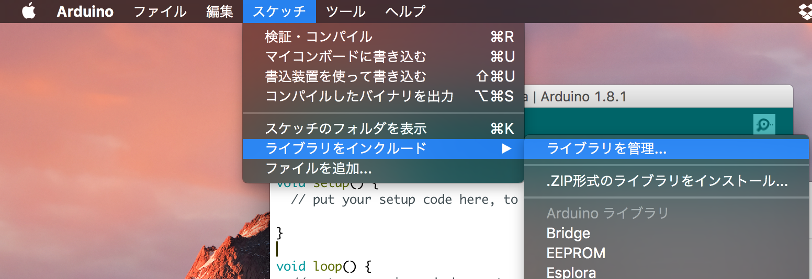

# 依存ライブラリのインストール

以下のライブラリを入れておくと次で入れるサンプルをコンパイルできる

- [Adafruit-PWM-Servo-Driver-Library](https://github.com/adafruit/Adafruit-PWM-Servo-Driver-Library)
- [DHT-sensor-library](https://github.com/adafruit/DHT-sensor-library)
- [IRremote](https://github.com/z3t0/Arduino-IRremote)

MacのArduinoIDEなら以下のようにたどってライブラリマネージャを開く．

それっぽく検索すると出てくるのでインストールを押すと勝手に入れてくれる．